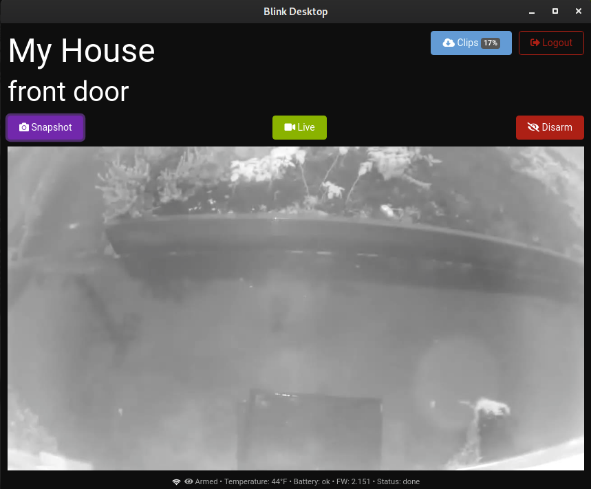

# blink-desktop

This is a cross-platform app to view [blink cameras](https://blinkforhome.com/).




## development

```
npm i           # install tools
npm start       # run hot-reloading development version
npm run make    # create distributable runtimes for release
npm run lint    # fix files according to code-standard
npm run publish # send to github releases
```

Press `Alt` to show menu (so you can use dev-tools, etc)


## TODO

* [X] add router
* [ ] live-video page
* [X] cloud-files page
* [ ] new motion notification system
* [ ] add functionality to home buttons
* [ ] add settings page
* [ ] add program page
* [ ] handle onboarding?
* [X] give local changes back to [blink-data](https://github.com/konsumer/blink-data)
* [ ] it's making too many requests, need to look at `useEffect` calls
* [ ] [sys-tray icon](https://github.com/kevinsawicki/tray-example) that notifies when there is motion and has options for arm/disarm & view media